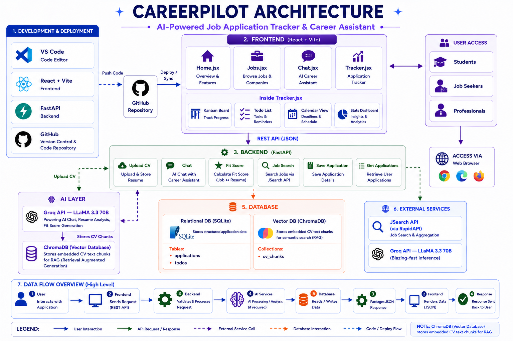

# CareerPilot

CareerPilot is an AI-powered career assistant that helps users manage their job applications, search for jobs, and get personalized feedback on their CVs.

## Problem Solved

CareerPilot addresses the challenges job seekers face in managing multiple applications, tailoring their CVs for specific roles, and efficiently searching for relevant job opportunities. It streamlines the job application process by providing tools for tracking applications, intelligent job searching, and AI-driven CV analysis.

## Tech Stack

### Frontend

*   **React**: A JavaScript library for building user interfaces.
*   **Vite**: A fast frontend build tool.
*   **Tailwind CSS**: A utility-first CSS framework for rapid UI development.
*   **ESLint**: A pluggable and configurable linter tool for identifying and reporting on patterns in JavaScript code.

### Backend

*   **FastAPI**: A modern, fast (high-performance) web framework for building APIs with Python 3.8+ based on standard Python type hints.
*   **SQLAlchemy**: An SQL toolkit and Object-Relational Mapper (ORM) for Python.
*   **ChromaDB**: An AI-native open-source vector database.
*   **Groq**: AI model for chat and fit score generation.
*   **python-dotenv**: Manages environment variables.
*   **pdfplumber**: Extracts text from PDFs.
*   **python-docx**: Reads and writes Word (.docx) files.
*   **requests**: HTTP library for making API calls (e.g., to job search APIs).

## Project Structure

```
.gitignore
architecture_diagram.png
README.md
backend/
├── careerpilot.db
├── main.py
└── requirements.txt
frontend/
├── .gitignore
├── eslint.config.js
├── index.html
├── package-lock.json
├── package.json
├── postcss.config.js
├── README.md
├── tailwind.config.js
├── vite.config.js
├── public/
│   ├── favicon.svg
│   └── icons.svg
└── src/
    ├── api.js
    ├── App.css
    ├── App.jsx
    ├── Chat.jsx
    ├── Home.jsx
    ├── index.css
    ├── Jobs.jsx
    ├── main.jsx
    ├── postcss.config.js
    ├── tailwind.config.js
    ├── Tracker.jsx
    ├── assets/
    │   ├── hero.png
    │   ├── react.svg
    │   └── vite.svg
    └── components/
        ├── CalendarView.jsx
        ├── Card.jsx
        ├── Column.jsx
        ├── KanbanBoard.jsx
        ├── StatsDashboard.jsx
        └── ToDolist.jsx
```

## Setup and Installation

### Prerequisites

*   Python 3.8+
*   Node.js and npm

### Backend Setup

1.  Navigate to the `backend` directory:
    ```bash
    cd backend
    ```
2.  Create a virtual environment and activate it:
    ```bash
    python -m venv venv
    source venv/bin/activate
    ```
3.  Install the required Python packages:
    ```bash
    pip install -r requirements.txt
    ```

### Frontend Setup

1.  Navigate to the `frontend` directory:
    ```bash
    cd frontend
    ```
2.  Install the Node.js dependencies:
    ```bash
    npm install
    ```

## How to Run Locally

### Run Backend

1.  Ensure you are in the `backend` directory and your virtual environment is activated.
2.  Run the FastAPI application:
    ```bash
    uvicorn main:app --reload
    ```
    The backend will be accessible at `http://127.0.0.1:8000`.

### Run Frontend

1.  Ensure you are in the `frontend` directory.
2.  Start the Vite development server:
    ```bash
    npm run dev
    ```
    The frontend will typically be accessible at `http://localhost:5173` (or another port if 5173 is in use).

## Key Features

*   **Job Application Tracker**: Manage and track the status of job applications.
*   **Job Search**: Search for job opportunities using an external API.
*   **CV Upload and Analysis**: Upload CVs (PDF/DOCX) and extract text content.
*   **AI Chat Assistant**: Interact with an AI assistant to get feedback and answers based on your CV.
*   **CV Fit Score**: Get a compatibility score between your CV and a job description.

## Environment Variables

Create a `.env` file in the `backend` directory with the following variables:

*   `GEMINI_API_KEY`: Your API key for the Gemini AI model.
*   `GROQ_API_KEY`: Your API key for the Groq AI model.
*   `RAPIDAPI_KEY`: Your API key for the RapidAPI job search service.

## Contributors

Based on the project structure and common practices, the primary contributor is likely the author of the initial codebase. Specific contributors can be identified through git history.

## Architecture Diagram


